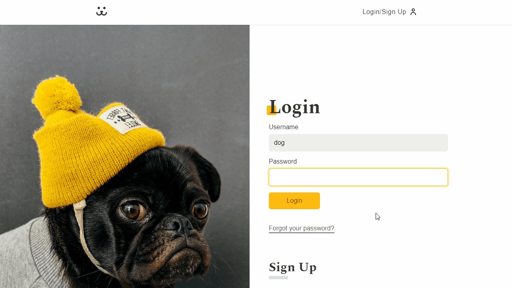

<div id="top" align="center">


<br>

# InstaDogs

<div>  
  <a href="#about">About</a> &#xa0; | &#xa0;
  <a href="#technologies">Technologies</a> &#xa0; | &#xa0;
  <a href="#link">Link</a> &#xa0; | &#xa0;
  <a href="#features">Features</a> &#xa0; | &#xa0;
  <a href="#preview">Preview</a> &#xa0; | &#xa0;
  <a href="#use">How to Use</a> &#xa0; | &#xa0;
  <a href="#resources">Useful Resources</a> &#xa0; | &#xa0;
  <a href="#license">License</a> &#xa0; | &#xa0;
  <a href="#author">Author</a>
</div>

<br>
</div>

<div id="about">

## 🐶 About

Social media app to share dogs' photos, created with ReactJS. InstaDogs is the final project of the React course from [Origamid](https://www.origamid.com/curso/react-completo/), a Brazilian learning platform.

This project was bootstrapped with [Create React App](https://github.com/facebook/create-react-app).

Test Account:

- Login: dog
- Password: dog

The API used in the project, created by Origamid, deletes new posts and comments every 10 minutes, keeping only the original ones.

</div>

<div id="technologies">

## 🛠️ Technologies

- HTML
- CSS Modules
- [React](https://pt-br.reactjs.org/)
- [React Router](https://reactrouter.com/en/main)
- [Victory](https://formidable.com/open-source/victory/)

</div>

<div id="link">

## 🔗 Link

- Live Site URL: [InstaDogs](https://julianachagas.github.io/instadogs/)

<div>

<div id="features">

## 💡 Features

✔️ Feed of photos \
✔️ View post details: author, total views, dog's name, age, and weight, and comments \
✔️ User authentication: login and auto login (using local storage) \
✔️ Create a new account \
✔️ Reset Password \
✔️ Post a new photo \
✔️ Post a new comment \
✔️ Delete posts \
✔️ Stats of your posts: total views and charts with the views of each post\
✔️ User profile page \
✔️ Infinite scroll \
✔️ Loading animation \
✔️ Image skeleton (placeholder for when an image is being loaded) \
✔️ Responsiveness

<div>

<div id="preview">

## 💻 Preview

- Home: main feed with infinite scroll

   <br/><br/>

- Login

   <br/><br/>
<div>

- Modal: post details and comments

   <br/><br/>

- Photo page and user profile

   <br/><br/>

- Post a new photo and dog's details (a preview of the photo is displayed)

   <br/><br/>

- Account page and stats

   <br/><br/>

- Mobile

   <br/><br/>

<div id="use">

## ⚙️ How to use

To clone and run this project you'll need [Node.js](https://nodejs.org/en/) and [Git](https://git-scm.com) installed on your computer. In addition, it is good to have an editor to work with the code like [VSCode](https://code.visualstudio.com/). Follow the instructions bellow:

```bash
# Clone this repository
$ git clone https://github.com/julianachagas/instadogs.git

# Go into the repository
$ cd instadogs

# Install the dependencies
$ npm install

# Run the app in development mode
# Open http://localhost:3000 to view it in your browser
$ npm start

# Build the app for production to the `build` folder
# It correctly bundles React in production mode and optimizes the build for the best performance.
$ npm run build

```

<div>

<div id="resources">

## 📚 Useful resources

- Original project design by <a href="https://github.com/origamid" target="_blank">André Rafael</a>

- Deploying React apps to GitHub Pages: <a href="https://blog.logrocket.com/deploying-react-apps-github-pages/" target="_blank">article from LogRocket</a>

<div>

<div id="license">

## 📝 License

This project is under license from MIT. For more details, see the [LICENSE](https://github.com/julianachagas/instadogs/blob/main/LICENSE) file.

<div>

<div id="author">

## 👩🏻‍💻 Author

<a href="https://www.linkedin.com/in/juliana--chagas/" target="_blank"></a>
<a href="https://twitter.com/JulianaCoding" target="_blank"></a>

<div>

---

##### Made with 💜 by Juliana Chagas

<p align="right"><a href="#top" align="right">(back to top)</a><p>
